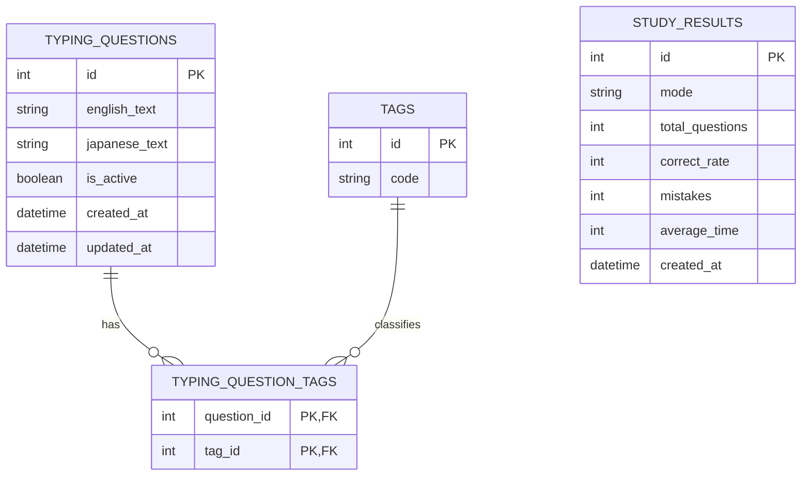

# Backend ER Diagram

以下は、バックエンドの `SQLModel` 定義と migration を元にした ER 図です。

補足:
- `typing_questions` は学習項目を表し、英語と日本語のテキストを保持します。
- `tags` と `typing_question_tags` により、1 問題へ 0 件以上の自由タグを紐付けられます。
- タグは学習者が自由に作成・付与でき、出題条件と教材分類の両方に利用されます。
- `tags.code` は正規化されたタグ文字列（小文字、トリミング済み）を格納し、ユニーク制約が設定されています。
- `typing_question_tags` は問題とタグの多対多関係を表現する結合テーブルです。
- `study_results` は現状、他テーブルへの外部キーを持たない独立テーブルです。
- 出題導線は独立した `quizzes` テーブルを持たず、`typing_questions` を `include_inactive=false` 条件で取得して利用します。
