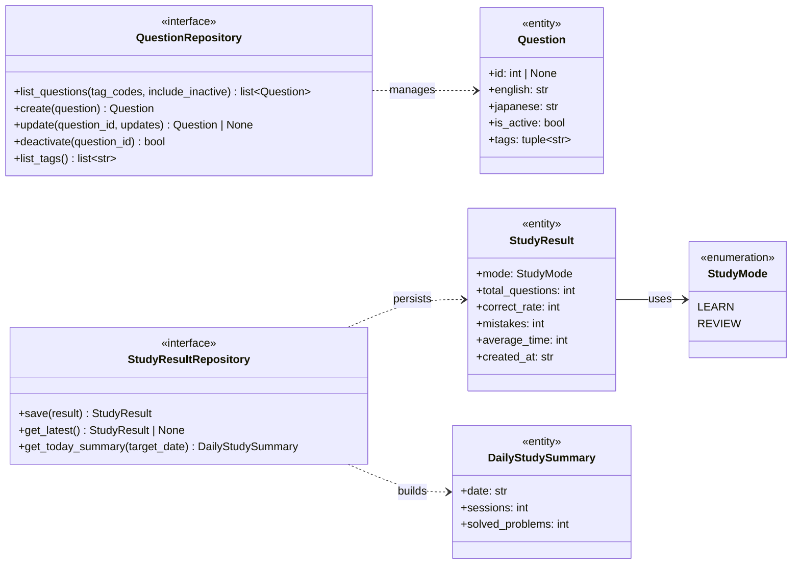

# Backend Domain Model

以下は、`backend/domain/entities.py` と `backend/domain/repositories.py` を元にしたドメインモデル図です。

補足:
- `Question` は自由タグを 0 件以上保持し、学習者が自分の目的に合わせて分類できます。
- タグは学習者が自由に作成・付与でき、出題条件と教材分類の両方に利用されます。
- `StudyResult` は `StudyMode` を保持し、学習モードごとの結果を表現します。
- `QuestionRepository` は `Question` の検索・作成・更新・無効化を担当し、タグ条件で検索できます。
- `QuestionRepository.list_tags()` は登録済みの全タグを返し、UI でのタグ選択に利用されます。
- `StudyResultRepository` は `StudyResult` の保存と、日次集計 `DailyStudySummary` の取得を担当します。
- 出題用の独立した `Quiz` エンティティは持たず、学習導線も `Question` を単一ソースとして扱います。
