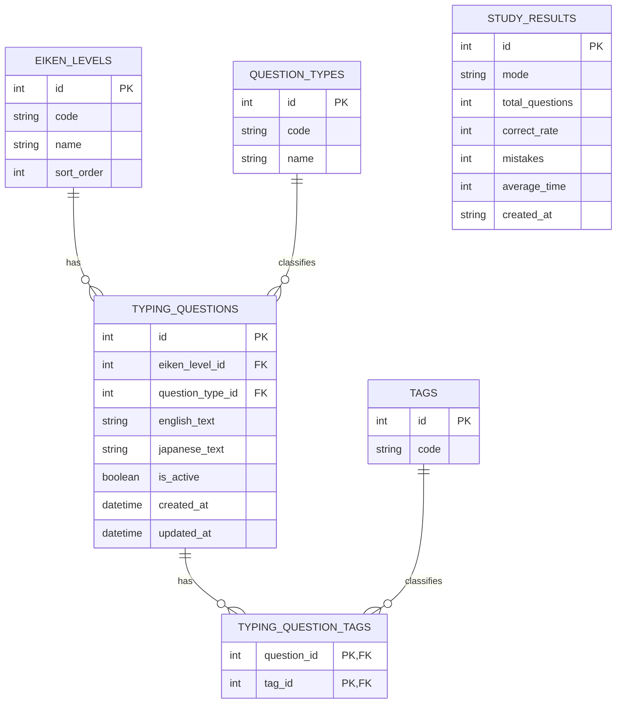

# Backend ER Diagram

以下は、バックエンドの `SQLModel` 定義と migration を元にした ER 図です。

補足:
- `EIKEN_LEVELS` 1 件に対して `TYPING_QUESTIONS` が複数紐づきます。
- `QUESTION_TYPES` 1 件に対して `TYPING_QUESTIONS` が複数紐づきます。
- `typing_questions` は `eiken_levels` と `question_types` を参照します。
- `tags` と `typing_question_tags` により、1 問題へ 0 件以上の自由タグを紐付けられます。
- `study_results` は現状、他テーブルへの外部キーを持たない独立テーブルです。
- 出題導線は独立した `quizzes` テーブルを持たず、`typing_questions` を `include_inactive=false` 条件で取得して利用します。
