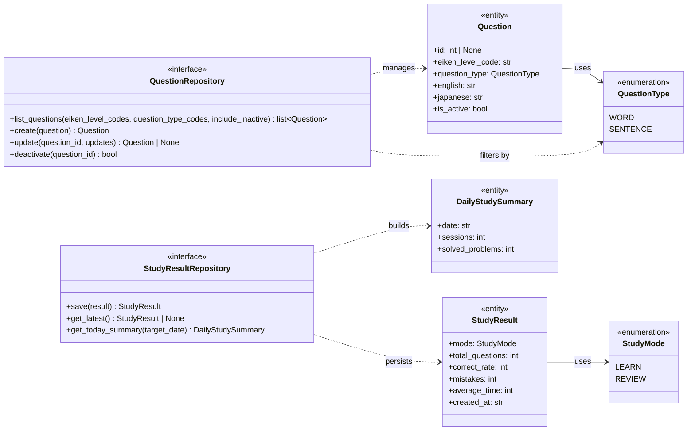

# Backend Domain Model

以下は、`backend/domain/entities.py` と `backend/domain/repositories.py` を元にしたドメインモデル図です。

補足:
- `Question` は `QuestionType` を保持し、出題種別を表現します。
- `StudyResult` は `StudyMode` を保持し、学習モードごとの結果を表現します。
- `QuestionRepository` は `Question` の検索・作成・更新・無効化を担当します。
- `StudyResultRepository` は `StudyResult` の保存と、日次集計 `DailyStudySummary` の取得を担当します。
